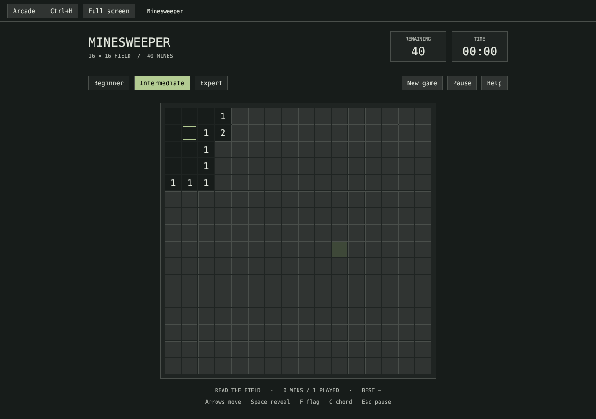

# Minesweeper


Native Rust Minesweeper inside Omarchy Arcade. Development addition for issue #43; not part of the published v0.2.0 package. Live Omarchy/Wayland acceptance is pending.

Reveal all safe cells. Beginner: 9×9/10 mines; Intermediate: 16×16/40; Expert: 30×16/99. The first reveal and its neighbours are safe. Empty areas expand automatically; flags block expansion. Random boards can require guessing.

| Action | Mouse | Keyboard |
| --- | --- | --- |
| Move focus | Click a cell | Arrows |
| Reveal | Left-click covered cell | Space |
| Flag/unflag | Right-click | F |
| Chord | Click revealed number or middle-click | C |
| Pause/resume | Pause / Resume | Esc |
| Return to collection | Arcade | Ctrl+H |

Chording reveals unflagged neighbours when the adjacent flag count matches the number. Wrong flags can cause a loss. Flag and mine silhouettes mark those states; X denotes an incorrect flag after losing. Numbers and symbols do not depend on colour. Expert fits the 900×760 minimum; smaller available regions scroll.

The timer starts with the first reveal and stops on completion. Pause, focus loss, help, new-game confirmation and leaving Arcade suspend timing. An unfinished board reopens paused. A new board replaces the current one after confirmation. Played counts include started boards that are subsequently abandoned; wins and best times are tracked per difficulty. The game is silent.

State is written atomically to `$XDG_STATE_HOME/omarchy-retro-arcade/minesweeper.json` (default `~/.local/state/omarchy-retro-arcade/minesweeper.json`), after actions, every five seconds and on normal exit. Invalid, oversized or future saves are preserved and writes disabled for that session. Move the rejected file aside while Arcade is closed to start saving again.

Build/run from the repository root:

```sh
cargo build -p omarchy-retro-arcade --locked
./target/debug/omarchy-retro-arcade --game minesweeper
cargo test -p omarchy-minesweeper --locked
```

The above builds the shared Rust window; the complete collection, including the Pinball worker, uses `scripts/build.sh` and its documented native dependencies. No separate installation is required. Reverting the source branch or reinstalling the previous Arcade package removes this game from the collection without deleting its save or any other game's data.

Original implementation and illustrative shelf SVG, GPL-3.0-or-later. No third-party game assets. See [verification](VERIFICATION.md) for reproduced checks and remaining desktop tests.

## Desktop appearance

The centred field, counters, controls, focus, hover states and dialogs derive from Omarchy’s current `colors.toml` (background, foreground, accent). Current XDG state paths take precedence over the legacy config path. Valid palette changes apply while playing; an unreadable or incomplete replacement keeps the last valid palette. Derived text colours enforce readable contrast. No fixed brass or sage accents are applied to this game.

The desktop monospace font resolves through `fc-match`, matching Omarchy’s fontconfig source of truth. Resolution runs off the UI thread with a bounded process timeout, validates font data and reloads changes without restarting the game. Bundled fonts remain the fallback if fontconfig or its selected font cannot be used. Gameplay keys remain Arrows/Space/F/C/Esc; theme changes do not alter key bindings.

## Application captures

Actual native app at runtime revision `26f774d`, captured under Xvfb at 1× with temporary game profiles and desktop palette fixtures. These demonstrate rendering, not Hyprland/Wayland acceptance.



[Light desktop palette](docs/light.png) · [Expert at 900×760](docs/expert.png)
